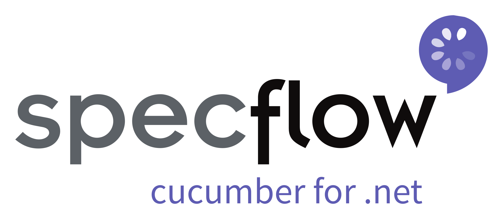
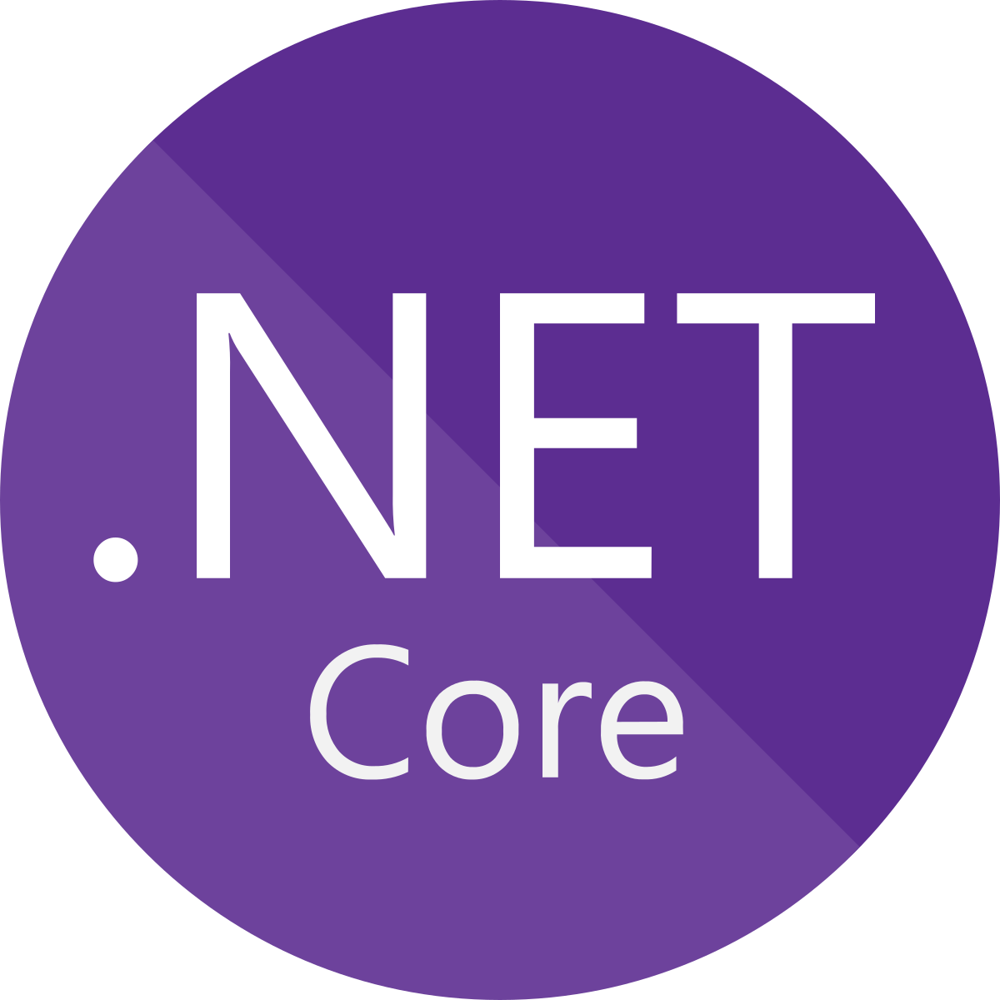
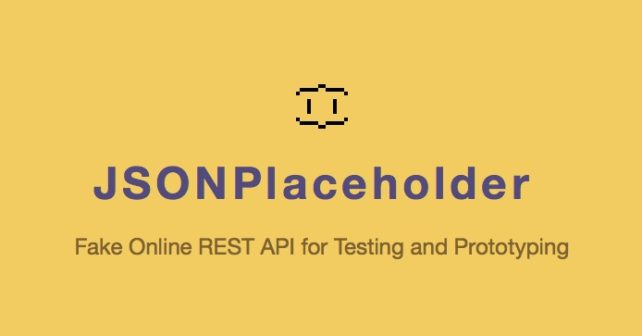
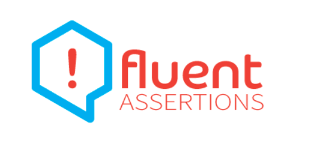

# RestApiTesting.Framework.Cheetah  
This is a RESTful API testing Framework using .NET Core, Specflow BDD test framework, HttpClient and Fluent Assertions to test JSONPlaceholder REST API.

## Specflow  
Use SpecFlow to define, manage and automatically execute human-readable acceptance tests in .NET projects. Writing easily understandable tests is a cornerstone of the BDD paradigm and also helps build up a living documentation of your system. https://specflow.org/

## Target framework  
.NET Core 2.1

## JSONPlaceholder  
JSONPlaceholder is a free online REST API that you can use whenever you need some fake data. It's great for tutorials, testing new libraries, sharing code examples.
https://jsonplaceholder.typicode.com/

## Routes Tested
The following HTTP methods are tested:
* GET
* POST
* PUT
* PATCH
* DELETE

## HttpClient
HttpClient class provides a base class for sending/receiving the HTTP requests/responses from a URL. It is a supported async feature of .NET framework. HttpClient is able to process multiple concurrent requests. It is a layer over HttpWebRequest and HttpWebResponse. All methods with HttpClient are asynchronous.
https://docs.microsoft.com/en-us/uwp/api/windows.web.http.httpclient

## Assertions 
Fluent Assertions is used for validation.
https://fluentassertions.com/ 

## Integrated Development Environment
Microsoft Visual Studio IDE is used to develop this Framework.
### Visual Studio Extensions
SpecFlow for Visual Studio
